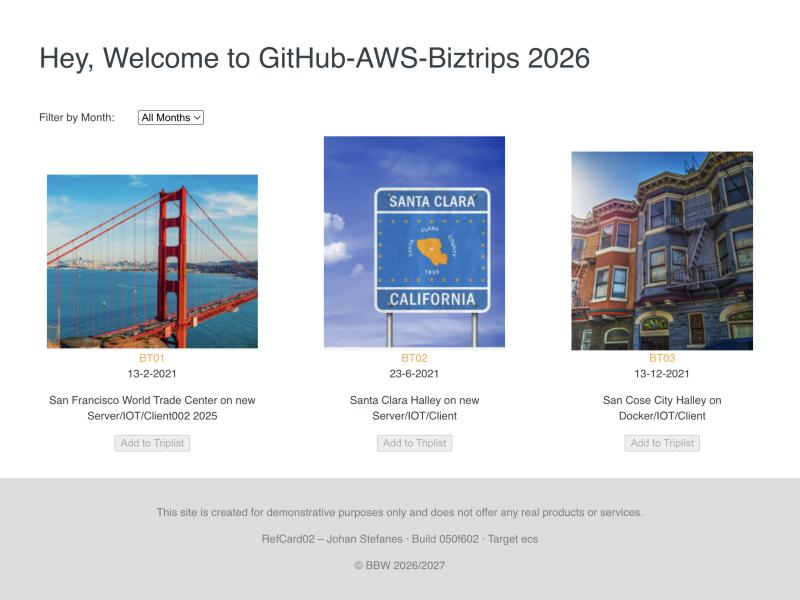

# RefCard02 – GitHub Actions, deploy · Dokumentation

**Johan Stefanes** · Modul 324 · Repo: [JohanStefanes/biztrips-2023-actions-aws-ec2](https://github.com/JohanStefanes/biztrips-2023-actions-aws-ec2)

Erkennungsmerkmal meiner Lösung: Im Footer jeder deployten Version steht
`RefCard02 – Johan Stefanes · Build <Git-Kurz-SHA> · Target <ec2|dockerhub|ecs>`.
Damit ist auf jedem Screenshot sichtbar, welcher Commit wohin deployt wurde.

## Pipeline im Überblick

```
push auf main ─► test ─► build ─┬─► deploy      (EC2, rsync/SSH)       EX-01
                                ├─► docker      (Docker Hub)           EX-02
                                └─► deploy-ecs  (ECR → ECS/Fargate)    EX-03
pull_request  ─► test ─► build   (kein Deploy, kein Image-Push)
```

| Job | Was passiert | Zugangsdaten |
| --- | --- | --- |
| `test` | `npm ci`, `npm test` (Vitest, u. a. Test auf die Build-Info im Footer) | – |
| `build` | `npm run build`, `dist/` als Artefakt | – |
| `deploy` | Artefakt per `rsync` auf EC2, `nginx` reload | Secrets `EC2_HOST`, `EC2_USER`, `EC2_SSH_KEY` |
| `docker` | Multi-Stage-Image, Tags `prod01`, `latest`, Kurz-SHA → Docker Hub | Secrets `DOCKERHUB_USERNAME`, `DOCKERHUB_TOKEN` |
| `deploy-ecs` | Image → ECR, Task-Definition rendern, Rolling Deployment auf ECS/Fargate | Secrets `AWS_ACCESS_KEY_ID`, `AWS_SECRET_ACCESS_KEY`, `AWS_SESSION_TOKEN` |

`deploy`, `docker` und `deploy-ecs` laufen nur, wenn die Repository-Variablen
`ENABLE_EC2_DEPLOY`, `ENABLE_DOCKERHUB_PUSH` bzw. `ENABLE_ECS_DEPLOY` auf `true` stehen
(werden von `scripts/set-github-config.sh` gesetzt). Grund: Die
Learner-Lab-Ressourcen und -Zugangsdaten leben nur während einer Lab-Sitzung;
ohne Schalter wäre die Pipeline ausserhalb der Sitzung immer rot.

## Quickstart – was war neu

- Workflows liegen als YAML unter `.github/workflows/`, Auslöser über `on:` (`push`, `pull_request`, `workflow_dispatch`).
- Jeder Job läuft auf einem frischen Runner; Daten zwischen Jobs nur über Artefakte (`upload-/download-artifact`).
- `needs:` baut die Reihenfolge (DAG), `if:` steuert, wann ein Job läuft (z. B. nur auf `main`).
- **Secrets** (verschlüsselt, im Log maskiert) vs. **Variables** (Klartext-Konfiguration) vs. **Environments** (z. B. `production` mit URL und optionalen Schutzregeln).
- Fertige Actions aus dem Marketplace (`actions/checkout`, `docker/build-push-action`, `aws-actions/*`) ersetzen viel eigenes Skripting.

---

## EX-01 – React/Vite-App auf AWS EC2

1. Lokales Repo mit GitHub verbunden: `git remote -v` → `origin` = `JohanStefanes/biztrips-2023-actions-aws-ec2`.
2. EC2-Instanz (Ubuntu 24.04, `t3.micro`) mit nginx vorbereitet – automatisiert mit
   [`scripts/aws/ec2-setup.sh`](../scripts/aws/ec2-setup.sh) (Security Group Port 22/80, nginx-Site `/var/www/biztrips` per User-Data).
3. Secrets/Variables gesetzt: `scripts/set-github-config.sh ec2` (Host, User `ubuntu`, privater Key `labsuser.pem`).
4. Environment `production` in GitHub angelegt.
5. Push auf `main` → Pipeline `test → build → deploy` läuft durch, Seite unter `http://<EC2_HOST>` erreichbar.

**Fehler & Behebung:** Der erste Run schlug im Schritt *SSH-Key einrichten* fehl, weil keine Secrets gesetzt waren
(`ssh-keyscan -H ""`). Lösung: Secrets setzen; zusätzlich prüft der Job jetzt die Secrets und gibt eine klare Fehlermeldung aus.

**Erweiterung:** Nur Änderungen auf `main` führen zu einem Image auf Docker Hub
(`if: github.ref == 'refs/heads/main' && github.event_name != 'pull_request'` im `docker`-Job).


## EX-02 – Docker-Image bauen, taggen, Docker Hub

- [`Dockerfile`](../Dockerfile) ist Multi-Stage: Stage 1 `node:24-alpine` baut `dist/`, Stage 2 `nginx:1.27-alpine` liefert nur die statischen Dateien aus → Image ≈ 78 MB, kein Node im Laufzeit-Image.
- Tagging-Strategie: `prod01` (aktuell produktiv), `latest` (letzter Build), Git-Kurz-SHA (unveränderlich, rückverfolgbar).
- Lokal gebaut und getestet:

```bash
docker build --build-arg VITE_BUILD_SHA=$(git rev-parse --short HEAD) -t biztrips:latest -t biztrips:prod01 .
docker run -d --name biztrips-local -p 8080:80 biztrips:latest   # → http://localhost:8080
```

- Docker-Hub-Repo `biztrips` angelegt, Access Token (Read & Write) erstellt, `scripts/set-github-config.sh dockerhub`.
- Manuell: `docker login`, `docker tag biztrips:latest <user>/biztrips:latest`, `docker push`, danach `docker pull <user>/biztrips:latest`.
- In der Pipeline übernimmt der Job `docker` Login, Build und Push mit allen drei Tags.


## EX-03 – Docker-Anwendung auf AWS ECS (Fargate)

Mit AWS Academy Learner Lab (Region `us-east-1`). Dort sind `iam:CreateRole` und OIDC-Provider gesperrt,
deshalb der dokumentierte Fallback: `LabRole` als Execution Role und temporäre Lab-Zugangsdaten als GitHub-Secrets.

1. Infrastruktur mit [`scripts/aws/ecs-setup.sh`](../scripts/aws/ecs-setup.sh) angelegt:
   ECR-Repo `biztrips`, Log-Group `/ecs/biztrips`, Cluster `biztrips-cluster`,
   Security Groups (ALB: 80 aus dem Internet; Tasks: 80 nur von der ALB-SG),
   Target Group Typ `ip`, ALB `biztrips-alb` in zwei Subnets, Task-Definition, Service `biztrips-service` mit 2 Fargate-Tasks.
2. [`task-definition.json`](../task-definition.json) enthält Platzhalter `AWS_ACCOUNT_ID`/`AWS_REGION` – die Pipeline ersetzt sie zur Laufzeit, damit keine Account-ID im Repo steht.
3. `scripts/set-github-config.sh aws` überträgt die Lab-Zugangsdaten in die Secrets und setzt `ENABLE_ECS_DEPLOY=true`.
4. Job `deploy-ecs`: Image → ECR (Tag Kurz-SHA + `latest`), Task-Definition rendern, `amazon-ecs-deploy-task-definition` mit `wait-for-service-stability: true`.




### Reflexionsfragen

1. **Was übernimmt ECS gegenüber dem SSH-Deploy?** Dateien verteilen (Image statt `rsync`), Webserver starten/neu laden (Container startet nginx selbst), Prozess am Leben halten (Service ersetzt abgestürzte Tasks), Health-Checks und Traffic-Umschaltung über den ALB.
2. **Warum OIDC statt dauerhaftem Key?** Das OIDC-Token gilt nur Minuten, nur für dieses Repo/diesen Branch und nur für die Rechte der Rolle. Ein geleakter dauerhafter Key (wie `EC2_SSH_KEY` mit vollem Serverzugriff) ist bis zur manuellen Rotation nutzbar.
3. **Was passiert bei `update-service`?** ECS startet Tasks mit der neuen Revision, wartet bis sie in der Target Group *healthy* sind, und stoppt erst dann die alten (Rolling Deployment). Die Seite bleibt erreichbar – beim Single-Server aus EX-01 werden Dateien live überschrieben, ohne Redundanz und ohne automatischen Rollback.
4. **Warum Target-Typ `ip`?** Fargate-Tasks laufen im `awsvpc`-Modus mit eigener ENI/IP und haben keine EC2-Instance-ID, auf die ein `instance`-Target zeigen könnte.

### Learner-Lab-Hinweis

Nach jedem Lab-Neustart ändern sich die Zugangsdaten: `~/.aws/credentials` aus *AWS Details → AWS CLI* aktualisieren
und `scripts/set-github-config.sh aws` erneut ausführen. Die EC2-Instanz erhält beim Neustart evtl. einen neuen Public-DNS → `ec2`-Secrets aktualisieren.
